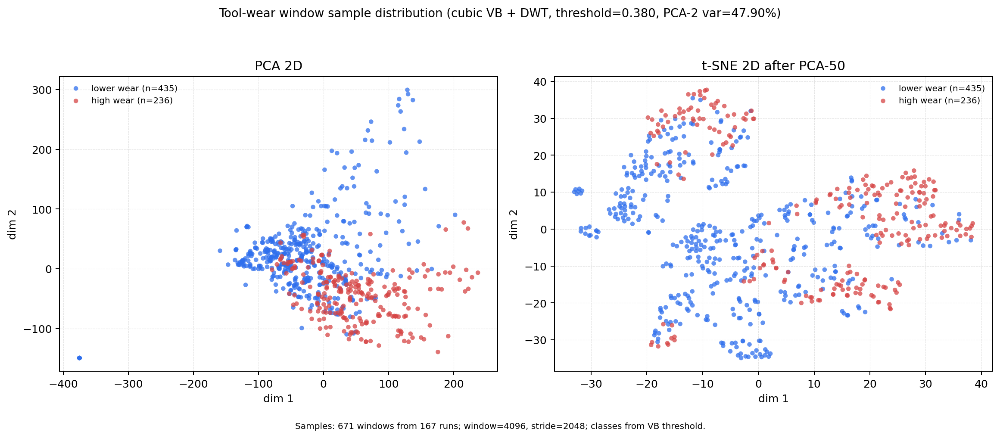

# Deep Learning for Tool Wear Prediction

本项目面向 NASA Milling 刀具磨损数据，主要包含两个实验方向：

1. 基于 1D DeepLabV3-ResNet50 的多通道时序信号磨损状态分类。
2. 基于 Stacked-BiLSTM + Attention 的少样本 VB 磨损值回归预测复现实验。

当前主网络是 `1D DeepLabV3-ResNet50`，用于将铣削过程中的多通道传感器信号映射为刀具磨损类别。

## 数据集

默认数据文件：

```text
3. Milling/mill.mat
```

使用的 6 个信号通道：

```text
smcAC
smcDC
vib_table
vib_spindle
AE_table
AE_spindle
```

标签来自 `VB` 刀具后刀面磨损值。当前分类实验采用二分类设置：

```text
class 0: lower wear
class 1: high wear
```

默认使用 `VB` 的 2/3 分位数作为二分类阈值，并在训练、验证数据集中保持同一个阈值。

## 主网络结构

主模型定义在：

```text
src/deeplabv3_model.py
src/resnet_backbone.py
```

整体结构：

```text
6-channel 1D signal
    -> ResNet50_1D Backbone
    -> ASPP1D
    -> DeepLabHead1D
    -> Global Average Pooling
    -> Binary Classification Logits
```

### ResNet50_1D Backbone

`src/resnet_backbone.py` 将标准 ResNet50 改造成一维卷积网络：

- `Conv2d` 改为 `Conv1d`
- 输入通道数为 6
- Bottleneck block 数量为 `[3, 4, 6, 3]`
- Layer3 和 Layer4 使用 dilation 替代部分下采样，以保留更长的时序分辨率

Backbone 输出两个特征：

```text
layer3 feature: 用于 aux classifier
layer4 feature: 用于 ASPP 主分支
```

### ASPP1D

`ASPP1D` 是 DeepLabV3 的一维版本，包含：

- `1x1 Conv1d`
- 多个不同 dilation rate 的 `3x1 Conv1d`
- 全局平均池化分支
- 拼接后通过 `1x1 Conv1d` 投影

当前 dilation rates：

```text
12, 24, 36
```

### 分类头

模型在 `classification=True` 时，会对时序维度做自适应平均池化：

```text
[batch, num_classes, length] -> [batch, num_classes]
```

因此当前任务不是逐点分割，而是样本级磨损状态分类。

## 训练流程

训练入口：

```text
train.py
```

主要设置：

```text
batch_size = 16
seq_length = 8192
epochs = 30
num_classes = 2
optimizer = AdamW
learning rate = 5e-4
weight_decay = 1e-4
scheduler = CosineAnnealingLR
loss = CrossEntropyLoss + aux loss
```

训练前会做以下处理：

- 固定随机种子
- 分层划分训练集和验证集
- 只使用训练集计算通道均值和标准差，避免验证集数据泄漏
- 训练集使用随机裁剪 `RandomCrop1D`
- 验证集使用确定性中心裁剪 `CenterCrop1D`
- 使用类别权重缓解类别不均衡
- 按验证集 `Macro F1` 保存最佳模型

运行训练：

```powershell
& 'D:\AppInsDir\Anaconda3\envs\pytorch-py3.12\python.exe' train.py
```

## 测试结果

### 1D DeepLabV3-ResNet50 分类结果

实验记录保存在：

```text
training_results.txt
```

数据划分：

```text
训练集: 116
验证集: 30
Binary VB threshold: 0.400000
```

验证集结果：

```text
Accuracy: 0.9333
Macro F1: 0.9282
```

混淆矩阵：

```text
Classes: [0 1]

[[18  1]
 [ 1 10]]
```

含义：

- 低磨损类 `0`：19 个样本，18 个预测正确
- 高磨损类 `1`：11 个样本，10 个预测正确
- 总计 30 个验证样本，28 个预测正确

### 1D DeepLabV3-ResNet50 分类结果：VB 插值 + 滑窗扩增

为进一步接近论文中的样本扩增思路，当前主分类数据集已支持：

- 同一 `case` 内按 `run` 顺序对缺失 `VB` 做线性插值
- 将每个 run 的原始 6 通道信号切成多个窗口样本
- 先按 run 划分训练集和验证集，再在各自集合内切窗，避免同一个 run 的窗口同时进入训练集和验证集
- 对原始信号中的极端异常值做稳健清洗，避免训练出现 `loss=nan`

实验设置：

```text
VB interpolation: True
Window size: 4096
Window stride: 2048
Binary VB threshold: 0.380000
训练 run: 133
验证 run: 34
训练窗口样本: 532
验证窗口样本: 139
```

验证集结果：

```text
Accuracy: 0.8993
Macro F1: 0.8886
```

混淆矩阵：

```text
Classes: [0 1]

[[84  7]
 [ 7 41]]
```

该实验相比原始 run 级分类使用了更多窗口样本，协议更接近“插值补标签 + 滑窗扩增”的少样本扩充思路，但验证集定义也发生变化，因此结果不应直接和原始 30 个 run 的验证结果简单等价比较。

### 1D DeepLabV3-ResNet50 分类结果：三次样条 VB 插值 + DWT + 滑窗

按论文的数据处理思想，分类模型进一步加入：

- `VB` 缺失值由线性插值改为三次样条插值。
- 对电流和振动通道使用 DWT 软阈值降噪：`smcAC`、`smcDC`、`vib_table`、`vib_spindle`。
- 继续使用 run 级划分后再滑窗，避免同一 run 的窗口泄漏到不同集合。

实验设置：

```text
VB interpolation: True
VB interpolation method: cubic
DWT denoise: True
DWT channels: smcAC, smcDC, vib_table, vib_spindle
Window size: 4096
Window stride: 2048
Binary VB threshold: 0.380000
训练 run: 133
验证 run: 34
训练窗口样本: 532
验证窗口样本: 139
```

验证集结果：

```text
Accuracy: 0.8561
Macro F1: 0.8475
```

混淆矩阵：

```text
Classes: [0 1]

[[76 15]
 [ 5 43]]
```

该结果低于上一版“线性 VB 插值 + 滑窗扩增”的 `Accuracy=0.8993`、`Macro F1=0.8886`。说明论文式降噪和三次样条插值并不会必然提升当前二分类网络；它主要提升了数据处理协议与论文的相似度，后续可继续比较“仅三次样条”“仅 DWT”“不同 DWT 通道”的消融实验。

### 1D DeepLabV3-LSTM 分类结果：更换主干网络

在保持“三次样条 VB 插值 + DWT + 滑窗”数据处理不变的情况下，将分类模型主干从 `ResNet50_1D` 切换为 `LSTMBackbone1D`。模型仍保留 DeepLabV3 的 ASPP 和分类头，因此本实验主要观察主干网络替换带来的影响。

实验设置：

```text
Backbone: lstm
VB interpolation: True
VB interpolation method: cubic
DWT denoise: True
DWT channels: smcAC, smcDC, vib_table, vib_spindle
Window size: 4096
Window stride: 2048
Binary VB threshold: 0.380000
训练 run: 133
验证 run: 34
训练窗口样本: 532
验证窗口样本: 139
```

验证集结果：

```text
Accuracy: 0.8561
Macro F1: 0.8409
```

混淆矩阵：

```text
Classes: [0 1]

[[81 10]
 [10 38]]
```

与同数据处理下的 `ResNet50_1D` 主干相比，LSTM 主干的 `Accuracy` 持平，`Macro F1` 从 `0.8475` 小幅下降到 `0.8409`。当前结果说明，单纯把分类模型主干换成 LSTM 没有明显提升；但误分类更均衡，后续可以尝试更轻量的 LSTM、BiLSTM、Attention pooling 或改为 VB 回归任务。

### 分类样本二维降维分布

为观察当前分类样本的可分性，新增二维降维可视化脚本：

```text
sample_visualizations/plot_sample_distribution_2d.py
```

该脚本使用当前分类实验的数据处理方式：

```text
VB interpolation method: cubic
DWT denoise: True
Window size: 4096
Window stride: 2048
Binary VB threshold: 0.380000
```

共生成 `671` 个窗口样本，其中低磨损类 `435` 个，高磨损类 `236` 个。脚本将每个窗口样本展平后标准化，并绘制：

- PCA 2D：观察线性降维下的整体分布。
- PCA-50 后 t-SNE 2D：观察非线性邻域结构。

输出图像：

```text
sample_visualizations/sample_distribution_2d.png
```



从图中可以看到，两类样本在 PCA 空间中存在一定趋势性分离，但重叠区域仍然明显；t-SNE 中局部簇结构更清楚，但高低磨损类仍存在混叠。因此当前二分类任务不是简单线性可分，继续提升模型时需要关注特征提取、标签阈值和相邻磨损阶段的过渡样本。

### Stacked-BiLSTM + Attention 回归结果

复现实验代码位于：

```text
stacked_bilstm_reproduction/
```

当前更接近论文的默认协议：

```text
sample_mode: segment_sequence
impute_vb: true
n_segments: 16
segment_window: 8
segment_step: 4
train_ratio: 0.30
val_ratio: 0.20
```

#### 较严谨划分：random_run

该设置按 run 分组随机划分，避免同一个 run 的不同窗口同时进入训练集和测试集。

运行命令：

```powershell
& 'D:\AppInsDir\Anaconda3\envs\pytorch-py3.12\python.exe' stacked_bilstm_reproduction\train_stacked_bilstm.py --data-root '3. Milling' --split-mode random_run
```

测试集结果：

```text
n_runs: 167
n_sequences: 501
train/val/test: 150 / 99 / 252

MAE: 0.1086
RMSE: 0.1651
R2: 0.5884
MAPE: 38.38%
```

#### 窗口级随机划分：random

该设置更接近一些论文中常见的随机窗口实验，指标更高，但可能存在同一 run 的窗口被分到不同集合的风险，因此结果偏乐观。

运行命令：

```powershell
& 'D:\AppInsDir\Anaconda3\envs\pytorch-py3.12\python.exe' stacked_bilstm_reproduction\train_stacked_bilstm.py --data-root '3. Milling' --split-mode random
```

测试集结果：

```text
MAE: 0.0633
RMSE: 0.0985
R2: 0.8644
MAPE: 24.18%
```

#### 论文口径 PMS 实验：Case 11 / Case 2

为进一步贴近 PDF 中的实验设置，新增了独立脚本：

```text
stacked_bilstm_reproduction/paper_like_pms_experiment.py
```

该脚本按论文表述做了以下处理：

- 只使用论文报告的两个工况：`Case 11` 作为 E1，`Case 2` 作为 E2。
- `Case 11` 使用 20 个有效 VB run，按每 run 5 段扩增为 100 个片段。
- `Case 2` 使用 13 个有效 VB run，按每 run 8 段扩增为 104 个片段。
- 对 VB 做三次样条插值，使扩增片段具有连续磨损标签。
- 从电流信号和振动信号分别提取 12 个时频特征，总输入为 24 个特征。
- 使用 DWT 软阈值降噪、LOWESS 局部加权平滑，以及 `PRes-MHSA-SBiLSTM` 风格回归模型。
- 使用论文中的 80% / 20% 随机划分、`Adam`、初始学习率 `0.012`、学习率衰减因子 `0.892`、最大迭代 `1500`、batch size `15`。

运行命令：

```powershell
& 'D:\AppInsDir\Anaconda3\envs\pytorch-py3.12\python.exe' stacked_bilstm_reproduction\paper_like_pms_experiment.py --data-root '3. Milling'
```

本次实验结果已记录在：

```text
stacked_bilstm_reproduction/paper_like_results.txt
```

测试集结果：

```text
Case 11 / E1:
MAE: 0.073472 mm (73.47 um)
RMSE: 0.117173 mm (117.17 um)
R2: 0.775545
MAPE: 51.35%

Case 2 / E2:
MAE: 0.020720 mm (20.72 um)
RMSE: 0.024198 mm (24.20 um)
R2: 0.943080
MAPE: 11.12%
```

与论文表 6 的 PMS 结果相比：

```text
论文 E1 / Case 11: RMSE 7.7 um, MAE 6.3 um
当前 E1 / Case 11: RMSE 117.17 um, MAE 73.47 um

论文 E2 / Case 2:  RMSE 10.5 um, MAE 8.2 um
当前 E2 / Case 2:  RMSE 24.20 um, MAE 20.72 um
```

当前仍未完全复现论文结果，主要差异包括：当前环境未安装 EMD 库，因此振动信号尚未执行论文中的 EMD 分解；论文未公开随机划分 seed、具体所选电流/振动通道、网络层数细节和 LOWESS 参数，小样本随机划分对结果影响较大。

#### 新增回归模型对比：PRes-MHSA-SBiLSTM 与 CNN-BiLSTM-Attention

考虑到 DeepLabV3 更适合语义分割而不是 run/window 级 VB 预测，新增两个独立回归实验目录：

```text
pres_mhsa_sbilstm_experiment/
cnn_bilstm_attention_experiment/
```

两个实验均采用相同数据协议：

- `Case 11` 作为 E1，`Case 2` 作为 E2。
- DWT 降噪、三次样条 VB 插值、LOWESS 风格特征平滑。
- 12 个电流特征 + 12 个振动特征。
- 80% / 20% 随机划分。
- `Adam`，初始学习率 `0.012`，最大迭代 `1500`，batch size `15`。

测试集结果对比：

| Model | E1 / Case 11 RMSE | E1 / Case 11 MAE | E2 / Case 2 RMSE | E2 / Case 2 MAE |
| --- | ---: | ---: | ---: | ---: |
| Paper PMS | 7.70 um | 6.30 um | 10.50 um | 8.20 um |
| PRes-MHSA-SBiLSTM | 117.17 um | 73.47 um | 24.20 um | 20.72 um |
| CNN-BiLSTM-Attention | 29.66 um | 22.72 um | 13.58 um | 10.47 um |

当前结果显示，`CNN-BiLSTM-Attention` 明显优于当前实现的 `PRes-MHSA-SBiLSTM`；尤其在 `Case 2 / E2` 上已经接近论文表 6 的 PMS 指标。后续更值得优先沿着 `CNN-BiLSTM-Attention` 做调参、消融和预测曲线分析。

### 结果说明

分类实验中的 1D DeepLabV3-ResNet50 在当前二分类验证集上表现较好，`Accuracy` 达到 `0.9333`，`Macro F1` 达到 `0.9282`。

回归实验中，`random_run` 更能反映模型对未见 run 的泛化能力；`random` 则更接近窗口级随机划分，结果更高，但需要在论文或报告中说明其划分方式。论文口径 PMS 实验已经把数据集范围、样本扩增方式、训练比例和超参数向论文靠齐，但由于 EMD 和若干未公开细节仍不一致，当前结果只能作为进一步逼近的实验基线。新增的 `CNN-BiLSTM-Attention` 在当前划分下表现最好，更适合作为下一步主线模型。

## Stacked-BiLSTM 少样本复现实验

该目录实现了：

- VB 缺失值插值
- 原始信号分段
- 每个信号片段提取统计特征
- Stacked-BiLSTM + Attention
- PRes-MHSA-SBiLSTM 风格论文口径实验
- 连续 VB 回归预测
- MAE、RMSE、R2、MAPE 指标

推荐运行：

```powershell
& 'D:\AppInsDir\Anaconda3\envs\pytorch-py3.12\python.exe' stacked_bilstm_reproduction\train_stacked_bilstm.py --data-root '3. Milling'
```

论文口径 PMS 实验：

```powershell
& 'D:\AppInsDir\Anaconda3\envs\pytorch-py3.12\python.exe' stacked_bilstm_reproduction\paper_like_pms_experiment.py --data-root '3. Milling'
```

批量少样本比例实验：

```powershell
& 'D:\AppInsDir\Anaconda3\envs\pytorch-py3.12\python.exe' stacked_bilstm_reproduction\run_few_sample_experiments.py --data-root '3. Milling'
```

## 项目结构

```text
.
├── 3. Milling/
│   └── mill.mat
├── src/
│   ├── __init__.py
│   ├── deeplabv3_model.py
│   ├── lstm_backbone.py
│   └── resnet_backbone.py
├── cnn_bilstm_attention_experiment/
│   ├── README.md
│   ├── results.txt
│   ├── summary.json
│   └── train_cnn_bilstm_attention.py
├── pres_mhsa_sbilstm_experiment/
│   ├── README.md
│   ├── results.txt
│   ├── summary.json
│   └── train_pres_mhsa_sbilstm.py
├── stacked_bilstm_reproduction/
│   ├── README.md
│   ├── dataset.py
│   ├── feature_extraction.py
│   ├── metrics.py
│   ├── model.py
│   ├── run_few_sample_experiments.py
│   └── train_stacked_bilstm.py
├── my_dataset.py
├── transforms.py
├── train.py
├── training_results.txt
└── README.md
```

## 说明

本项目当前更适合用于两类实验：

1. 将 1D DeepLabV3-ResNet50 用于刀具磨损状态分类。
2. 将 Stacked-BiLSTM、PRes-MHSA-SBiLSTM、CNN-BiLSTM-Attention 用于少样本连续 VB 回归预测。

如果用于论文实验，建议明确区分分类任务和回归任务，并在结果表中分别报告分类指标和回归指标。
